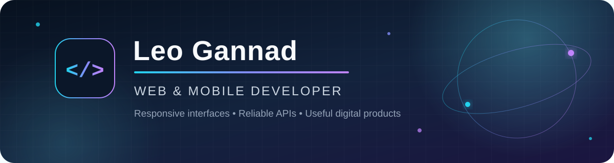

<p align="center">
  
</p>

<p align="center">
  <a href="mailto:leo.b.gannad@isu.edu.ph"></a>
  <a href="https://www.linkedin.com/in/leo-gannad-a66a48410"></a>
  <a href="https://www.facebook.com/share/1Gy5jdzJ5N/"></a>
</p>

## About me

I am a web and mobile developer from Cabagan, Isabela, Philippines, currently completing my Bachelor of Science in Information Technology. I enjoy turning practical ideas into responsive interfaces, reliable APIs, and useful digital products.

- Building full-stack web and cross-platform mobile applications
- Working on **GeoSentri**, an IoT-enabled police operations and GPS monitoring platform
- Interested in realtime systems, mapping, cloud deployment, and application security
- Continuously improving through hands-on projects and production deployments

## Tech stack

### Frontend and mobile

<p>
  
  
  
  
  
  
  
  
  
</p>

### Backend and data

<p>
  
  
  
  
  
  
  
</p>

### Cloud and tools

<p>
  
  
  
  
  
</p>

## Featured projects

| Project | What it does | Stack |
| --- | --- | --- |
| [GeoSentri / BantayCabagan](https://github.com/CoffeeDev-Err/CapstoneProject-IoT) | IoT-enabled police operations platform for realtime GPS monitoring, deployments, tasks, and incident reporting. | React, React Native, Node.js, MongoDB, AWS, MQTT |
| [POS v3](https://github.com/CoffeeDev-Err/POS_v3) | Full-stack point-of-sale and inventory system with sales, credit, expenses, users, receipts, and reports. | React, Laravel, MySQL |
| [Payroll System](https://github.com/CoffeeDev-Err/payroll-system) | Role-based HR and payroll platform for employees, departments, leave requests, payslips, and analytics. | React, Laravel, Sanctum |
| [Cellphone Shop](https://github.com/CoffeeDev-Err/E-Commerce-) | Customer storefront and admin dashboard for devices, accessories, orders, inventory, and sales reports. | React, Express, Firestore |
| [CosmoBlitz](https://github.com/CoffeeDev-Err/CosmoBlitz) | Retro browser space shooter with phased combat, bosses, audio, and persistent high scores. | HTML, CSS, JavaScript, Canvas |
| [Developer Portfolio](https://github.com/CoffeeDev-Err/porfolio-codecoffee) | Responsive personal portfolio with typed content, themes, project details, and GSAP motion. | React, TypeScript, Tailwind CSS, GSAP |

## Current focus

```text
Designing clear interfaces  •  Building dependable APIs
Shipping mobile experiences •  Deploying secure cloud systems
```

<p align="center">
  <sub>Built with coffee, curiosity, and code.</sub>
</p>
